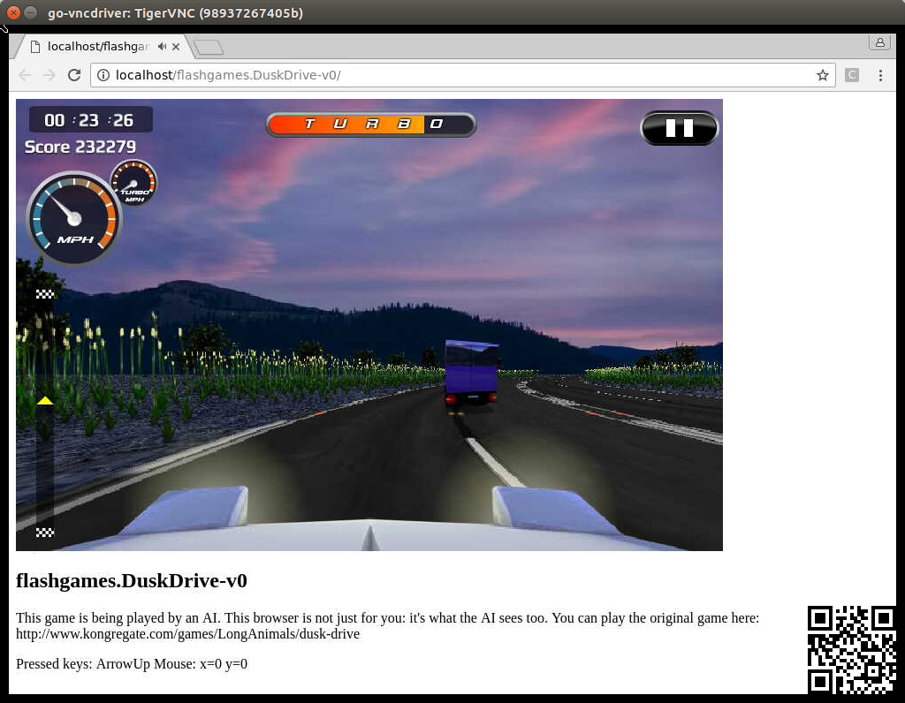

This document shows how to run openAI Universe (released Dec. 5, 2016) on Ubuntu 16.04 with Python 3. 

## Setup git account
* git config --global user.name "<YourGitHubUserName>"
* git config --global user.email "<YourGitHubEmail>"
* generate a ssh key for your account
```
ssh-keygen -t rsa -C "<YourGitHubEmail>"
```
you should select to overite your old one. 
* then add the public key to your github account. 
```
cat ~/.ssh/id_rsa.pub
```
copy and paste to GitHub Setting SSH Key. 

## Install Docker
* prerequisites: [follow here](https://docs.docker.com/engine/installation/linux/ubuntulinux/#/install-the-latest-version)   
* [install the latest version of docker](https://docs.docker.com/engine/installation/linux/ubuntulinux/#/install-the-latest-version)

## Run Docker as a non-root user 
Try
```
docker ps
```
It will say:
```
Cannot connect to the Docker daemon. Is the docker daemon running on this host?
```
This is because by default docker is only run with sudo users. Try another one with sudo
```
sudo docker run -it ubuntu bash
```
This will start a bash in docker image. 

So the last step is to add the currrent user to the docker group. 
```
sudo usermod -aG docker $USER
```
If you don't do this, you will later see permission errors with OpenAI Universe. 

## Install Universe 
OS: Ubuntu 16.04

### create a conda environment:
```
conda create --name openai-universe python=3
source activate openai-universe
pip install gym
pip install universe
```

## Start docker 
Run 
```
sudo service docker start
```
It will have no output. To check status, do
```
systemctl status docker.service
```

## Test
to quickly test whether Unviverse is installed correctly, do 
```
python -c "import gym; import universe"
```
No error. So it is correctly installed!

## Setup Pycharm
You can set up Pycharm's interpretter to use the same anaconda env you created. 
Go Terminal, 
```
source activate openai-universe
which python
```
copy the output. Go to Pycharm Settings, Interpretter, "add local", paste. 


## DustDrive on Universe
In Pycharm, create a project, add a python file with the following content:
```
import gym
import universe  # register the universe environments

env = gym.make('flashgames.DuskDrive-v0')
env.configure(remotes=1)  # automatically creates a local docker container
observation_n = env.reset()

while True:
  action_n = [[('KeyEvent', 'ArrowUp', True)] for ob in observation_n]  # your agent here
  observation_n, reward_n, done_n, info = env.step(action_n)
  env.render()
```
It basically runs a game in a browser with a simple agent keeping pressing the "arrow up" key. 

## Screenshots:



